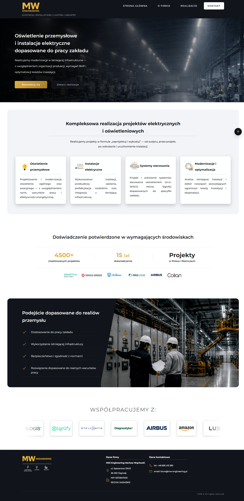
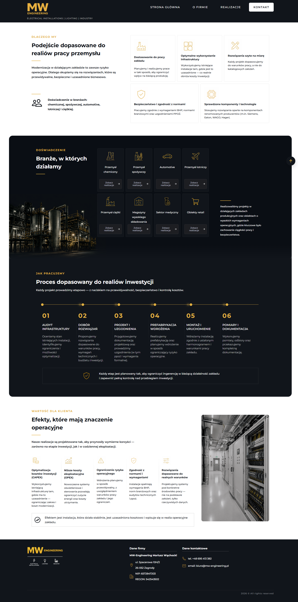
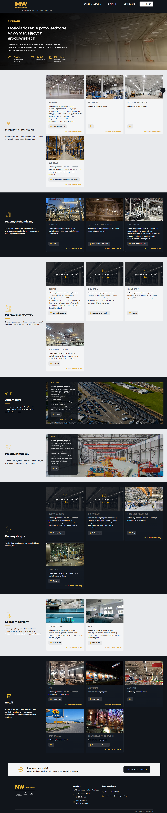
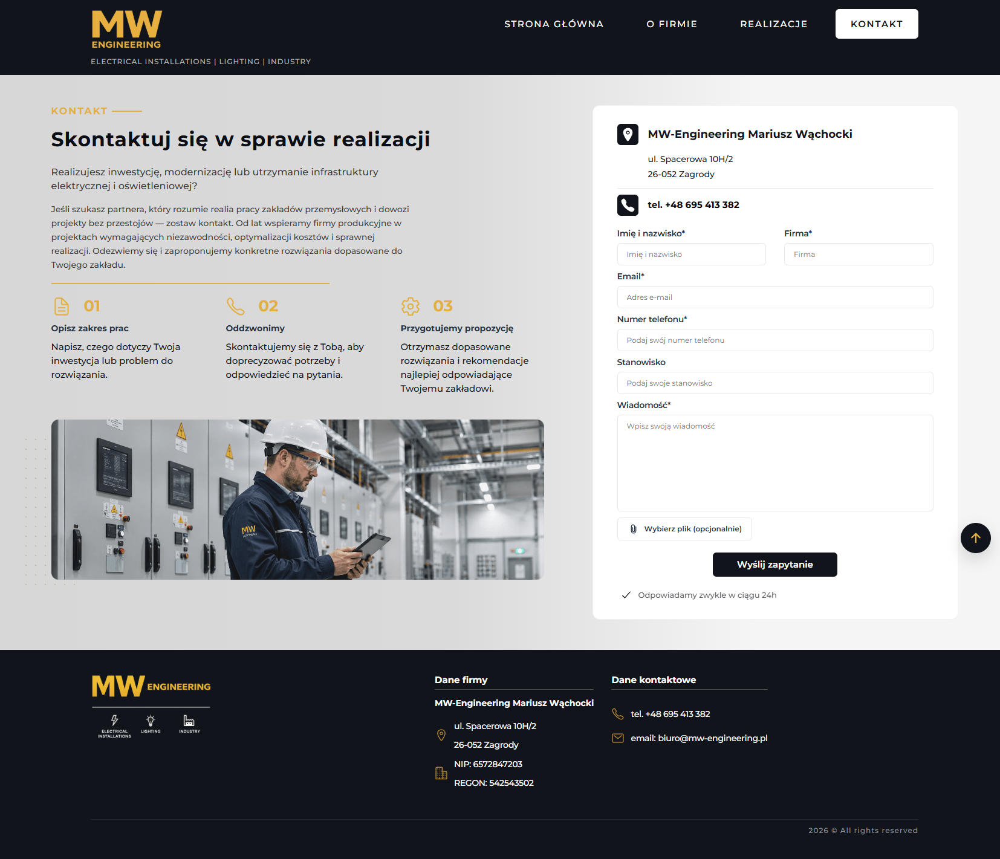
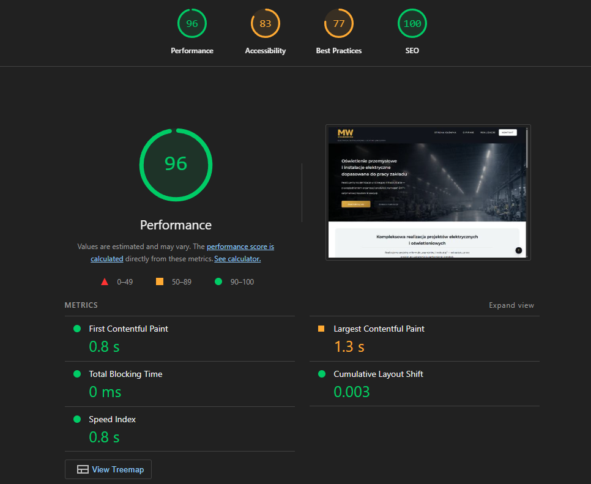

# MW Engineering Website

A responsive corporate website developed for MW Engineering, a company specializing in electrical installations, industrial lighting, control systems and infrastructure modernization.

The project was designed and developed from scratch based on the client's business requirements. My goal was to create a modern, professional and user-friendly website that presents the company's services, completed projects and contact information while providing a seamless experience across different devices.

🔗 **Live Demo:** https://mw-engineering.pl

---

**Note:** The repository contains the latest version of the project. Some features available in the source code have not yet been deployed to the live website.

## Preview

### Home Page

### About Page

### Projects Page

### Contact Page

---

## My Responsibilities

I was responsible for the complete frontend implementation of the website, including:

- Designing the website layout and user interface
- Planning the overall page structure
- Translating business requirements into a functional website
- Building responsive layouts for desktops, tablets and mobile devices
- Developing interactive JavaScript features
- Developing the website styling with CSS
- Implementing and integrating the contact form with validation, file attachments and submission feedback
- Deploying the website to the production server

---

## Key Features

- Responsive multi-page website
- Responsive mobile navigation
- Hero video section
- Automatically scrolling partner logos carousel
- Interactive project galleries with image modals and intuitive closing controls
- Contact form with email functionality
- Validation of required fields and privacy consent
- Optional file attachments with file type and size validation
- Success and error messages after form submission
- Embedded Google Maps
- Privacy Policy page
- Lazy-loaded images
- Basic technical SEO (canonical links, Open Graph metadata, XML Sitemap and robots.txt)

---

## Challenges & Solutions

### Designing without a ready-made design

The client provided business requirements, content and images, but no visual design. I planned the page structure and designed the interface from scratch to create a clear, professional and user-friendly experience.

### Responsive layouts

The website was designed to work across desktop, tablet and mobile devices. I created responsive layouts to ensure readability and usability on different screen sizes.

### Interactive galleries

I implemented reusable JavaScript functionality for opening and closing image galleries using modal windows, making project presentations more intuitive for users.

---

## What I Learned

This project helped me strengthen my practical frontend development skills by:

- Turning business requirements into a complete website
- Designing responsive layouts for multiple screen sizes
- Organizing and maintaining a larger multi-page project
- Working with a real client and deploying a production website
- Gaining experience with basic technical SEO
- Improving my problem-solving and debugging skills
- Improving browser compatibility through cross-browser CSS optimization
- Optimizing images and static assets for better performance

---

## Technologies

- HTML5
- CSS3
- Flexbox
- Media Queries
- JavaScript
- PHP – contact form integration

---

## Performance

The website was optimized for performance, accessibility, SEO and best practices.
Google Lighthouse performance scores ranged from 89 to 96 across the website pages.

---

## Author

Designed and Developed by Karolina Szary
